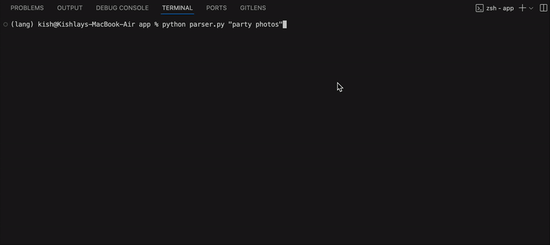

# monkeSearch

A prototype system that brings natural language search capabilities to your file system (macOS only for now), allowing you to search for files using everyday language like "python scripts from last week" or "photos from yesterday". Nothing leaves your pc, offline inference and can even run on potato PCs. You don't need a massive GPU rig to run the small model backing the intelligence.


> ⚠️ **Prototype**: This is an initial proof-of-concept implementation. Expect rough edges and limited functionality.
> Currently aimed at macOS but the logic is independent for cross platform adaptations. (In the works!)

> ### Developer note:
> I've been working on this project since long and this idea had many versions. Future plans include finetuning Gemma 3 270M and adding more smart features like temporal expressions and operators + smarter aggregation (See [future plans](src/technical.md) and please help me in implementing them! ).   
> The current turnaround time for this tool to recieve a query and give out files is around 1 second and doesn't exceed it, the largest bottleneck is model inference. This is under active
> development and any new suggestions + PRs are welcome. My goal for this tool is to be open source, safe and cross platform. So developers experienced in Windows/Linux Indexing are
> very welcome to collaborate and develop their versions together.
>
> 
> please star the repo too, if you've read it till here :P

## Overview



> shows zero results because i don't have any videos related to "wedding"
This system combines:
- **AI-powered query parsing** using a local LLM (Qwen 0.6B) to understand natural language
- **Native macOS Spotlight integration** for fast, efficient file searching. (cross platform support is very welcome for development!)
- **Intelligent file type recognition** that understands context (e.g., "resume" → PDF/DOCX files)
- **Temporal expression parsing** for time-based searches. (3 weeks ago, 10 months ago, etc.)

## Example Queries
#### You can convert any natural language query to 3 major constituents: File type, temporal data (time related), and miscellaneous (file name, path etc.) I used this idea as base to build the whole project, and yes it is that simple.


| Natural Language Query | What It Finds |
|------------------------|---------------|
| `"photos from yesterday"` | Image files modified in the last day |
| `"python scripts from three days ago"` | .py and .ipynb files from 3 days ago |
| `"old music files"` | Audio files with "old" in name or content |
| `"pdf invoices from 2023"` | PDF files from 2023 with "invoices" keyword |
| `"resume from last week"` | Recent DOC/DOCX/PDF files with "resume" |
| `"code files"` | Source code files of any language |


## Requirements

- **macOS** (required for Spotlight integration)
- **Python 3.8+**
- **Ollama running qwen0.6b** (local LLM server)

> Currently planning to fine tune Gemma 3 270M for a smaller and faster model for this use case. Also aiming at using llama.cpp 

## Installation

### 1. Clone the Repository
```bash
git clone https://github.com/monkesearch/monkesearch
cd monkeSearch
```


### 2. Install dependencies using the requirements file:
```bash
pip install -r requirements.txt
```

### 3. Install and Setup Ollama

**Using Homebrew:**
```bash
# Install Ollama
brew install ollama

# Start the Ollama server (keep this running in a separate terminal)
ollama serve

# In another terminal, pull the Qwen model
ollama pull qwen3:0.6b
```

**Alternative installation** (if not using Homebrew):
- Download Ollama from [ollama.com](https://ollama.com)
- Follow the installation instructions for macOS

### 4. Verify Setup
```bash
# Check if Ollama is running
curl http://localhost:11434/api/tags

# Test the parser
python parser.py "python files from yesterday"
```

## Usage

### Command Line
```bash
# Basic search
python parser.py "photos from last week"

# More examples
python parser.py "python scripts modified yesterday"
python parser.py "pdf invoices from 2023"
python parser.py "music files"
python parser.py "old presentations"
```

### As a Module
```python
from parser import FileSearchParser

# Initialize the parser
searcher = FileSearchParser()

# Perform a search
results, parsed_data = searcher.search("python files from last week")

# results contains file paths
for path in results:
    print(path)
```

## Limitations

- **Indexed Files Only**: Only searches files indexed by Spotlight
- **Local Model Limitations**: The small AI model may misunderstand very complex queries
- **Basic Temporal Parsing**: Currently supports simple time expressions (More features to be added soon! See [technical](src/technical.md) for planned features)

## License

Apache-2.0 license

## Acknowledgments
- Big thanks to [utitools](https://github.com/RhetTbull/utitools)
- Built with [LangExtract](https://github.com/google/langextract) for structured extraction
- [Ollama](https://ollama.com) for local LLM inference. 
- Uses Apple's Spotlight and Foundation frameworks.

---

**Note**: This is an experimental prototype created to explore natural language file searching on macOS. It's not production-ready and should be used for experimentation and learning purposes. 
